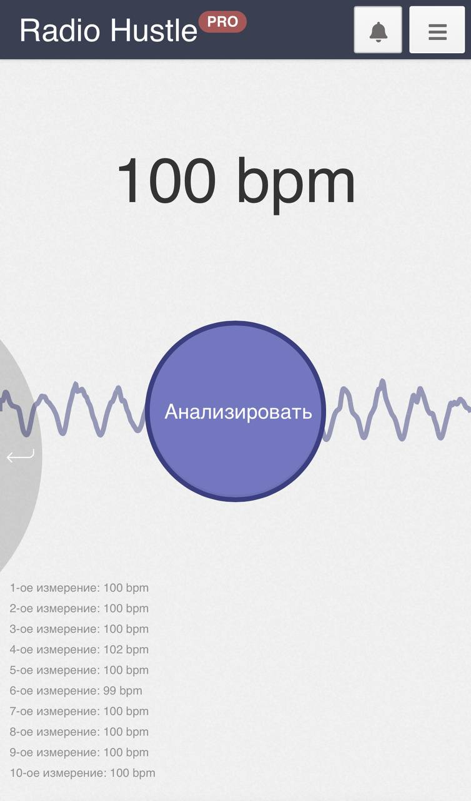

# Определение bpm (beats per minute) в браузере

## Вступление: зачем это?

Когда-то я занимался спортивными парными танцами. Часто на тренировках
была необходимость узнать темп (или скорость, если немного подушнить
насчёт терминов) играющего трека, который измеряется
в "ударах в минуту" (`beats per minute`, `bpm`)

Спортсмены используют для этого разные сайты/приложения, где нужно пальцем
"протапать" ритм. Я и сам таким пользовался, но однажды я задался
вопросом — смогу ли я сделать браузерный сервис, который сможет
определять `bpm` из записанного через микрофон аудио

Эта статья как раз о том, как я его сделал

Я не буду вдаваться в тонкости реализации непосредственно UI: у меня уже
был на момент начала разработки пет-проект на React, и сервис я решил делать на базе него.

## Принцип работы

Дадим возможность пользователю один раз тапнуть на кнопку *Анализировать* и будет
показывать ему вычисляемый `bpm`, назовём его $`B`$, который со временем (с каждой
итерацией анализа) будем уточнять:

* Запускаем $`i`$-ый анализ
* Записываем звук с микрофона длиной $`t_{i}`$
* Вычисляем темп $`b_{i}`$
* Уточняем значение $`B`$ на основе $`b_{i}`$

После всех итераций значение $`B`$ и будет тем `bpm`, что мы ищем.

Пока каждый пункт звучит мутно (кроме первого, пожалуй). Распишем их подробнее

### Итерации анализа `bpm`

Определимся с количеством итераций, пусть это будет $`n`$.
Так как мы будем записывать звук "кусками", то определим массив $`t_{i}`$ их длин.
Я экспериментировал с разными значениям $`t_{i}`$:

* $`t_{i} = F_{i}`$, где $`F_{i}`$ — $`i`$-ое число Фибоначчи
* $`t_{i} = 2{i}`$
* $`t_{i} = 2^{i}`$

В итоге остановился на варианте $`\forall i, t_{i} = t_0`$, где $`t_0`$ — константа.

> В итоговой реализации взял значения $`n = 10`$ и $`t_0 = 6`$

### Запись звука

Будем аписывать звук с микрофона через `AudioWorklet`, собирать
сэмплы в `Float32Array`, а потом складывать их в `AudioBuffer`, который
можно использовать для анализа.

Если расписывать этот этап подробнее по шагам, то получится следующее:

* Получение доступа к микрофону
* Создание AudioContext
* Создание AudioWorklet для захвата аудиоданных
* Подключение AudioWorklet к AudioContext
* Подключение микрофона к ворклету
* Сбор аудиоданных
* Финальная сборка в AudioBuffer
* Возврат результата

> [Код можно посмотреть здесь](./bpm_record_audio.md)

### Вычисление темпа $`b_i`$

Сделаем метод `getBPMFromAudioBuffer`, который вычисляет примерный
темп $`b_i`$ трека из аудиобуфера, анализируя пики энергии
сигнала (предполагаемые удары) и измеряя интервалы между ними.

Распишем пошагово, что будет делать метод

#### Преобразование звука в моно

На каждой позиции берётся среднее значение левого и правого канала.
Это упрощает дальнейшую обработку.

#### Разделение сигнала на окна и расчёт энергии

Сигнал разбивается на кусочки (или "окна", в моём случае такой `hopSize = 512 сэмплов`).
Для каждого куска считается энергия ("громкость" в каждом фрагменте времени): сумма
квадратов амплитуд в окне.

#### Поиск пиков энергии (ударов)

Вычисляется средняя энергия по всему сигналу.
Удар (`onset`) считается найденным, если

* энергия окна выше средней 
* энергия локально максимальна (больше соседей слева и справа)
* время удара рассчитывается из номера окна и длины сэмплов

#### Расчёт `bpm` по интервалам между ударами

Находятся интервалы между ударами (в секундах).
Оставляются только интервалы, которые соответствуют 30–240 BPM, чтобы убрать шум.
Из каждого интервала считается `bpm = 60 / interval`.
Собирается гистограмма (сколько раз встречался каждый `bpm`).
Выбирается самый частый `bpm` — он считается результатом $`b_i`$ для $`i`$-ого анализа.

> [Код можно посмотреть здесь](./bpm_from_audio_buffer.md)

### Уточнение итогово значения темпа $`B`$

После каждого анализа мы хотим обновлять итоговое значение, применяя некий
метод для уже посчитанных $`b_{i}`$.

Имперически получилось выяснить, что среднее и медиана не дают близкий к реальности
результат, в отличие от экспоненциальгого скользящего среднего (`ema`) с коэффициентом
$`\alpha = 0.2`$, точность которого составила 95% на тестовых данных.

$`B = ema(b_i)`$

> [Код можно посмотреть здесь](./bpm_ema_smooth.md)

## Итог

После выполнения всех итераций итоговым темпом играющего трека
будет значение $`B`$.

Посмотреть реализацию можно на [Radio Hustle](https://app.radiohustle.online/bpm)

